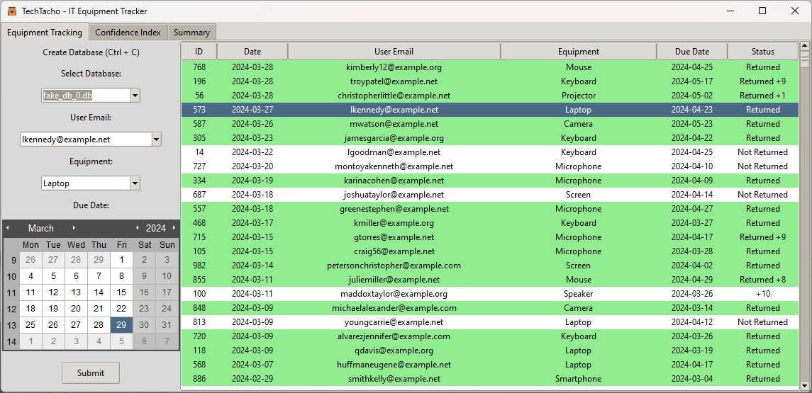
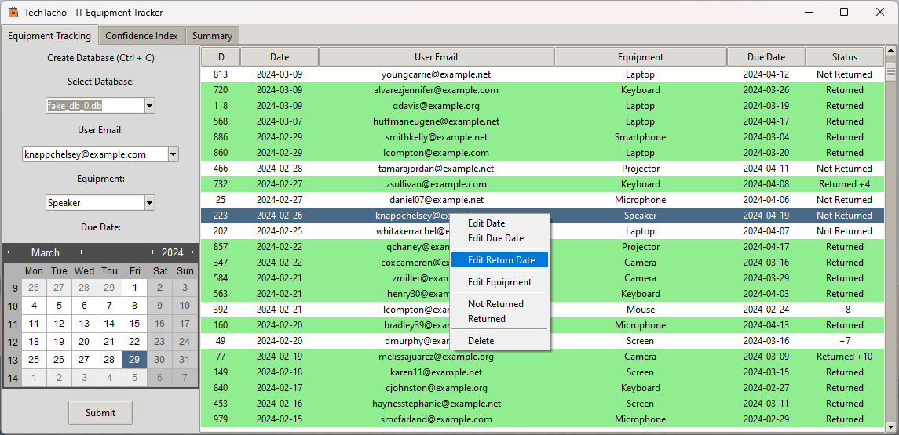
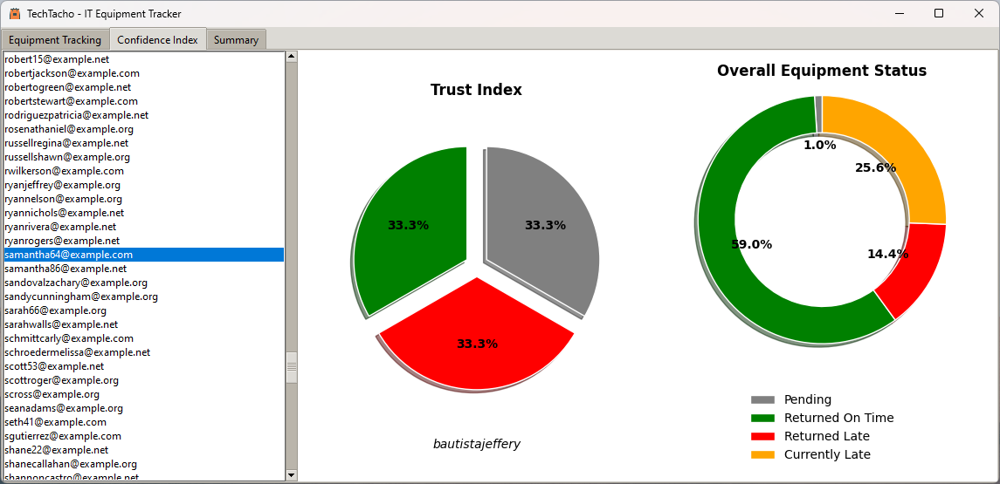
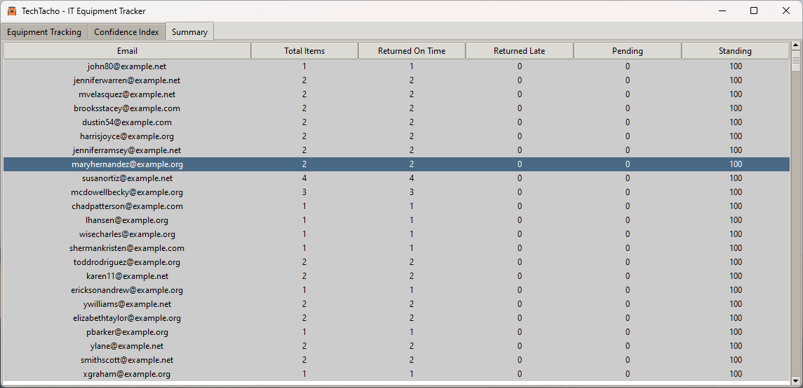

Pending ...

# TechTacho - Equipment Tracking System

TechTacho is a versatile equipment tracking application designed to manage and monitor the usage of technological equipment. This user-friendly desktop application simplifies the process of tracking equipment borrowing, due dates, and return statuses, ensuring efficient inventory management and accountability.

## Key Features

- **Database Management**: Create and manage databases for tracking equipment borrowing activities.
- **Equipment Borrowing Tracking**: Record the borrowing details, including the borrower's email, equipment type, due date, and return status.
- **Visualization**: Use pie charts to represent the equipment status visually, providing clear and immediate insight into inventory status.
- **Email Reminders**: Set up automated reminders for overdue items to ensure timely returns and avoid inventory shortages.
- **Reporting**: Keep track of borrowing history and sort/filter records for detailed reporting.

## Getting Started

### Prerequisites

Before running TechTacho, you need to have Python installed on your machine, along with the following libraries: `Faker`, `pandas`, `sqlite3`, `tkinter`, and `matplotlib`.

### Installation

1. Clone the repository or download the `TechTacho.py` script to your local machine.
2. Install the required Python libraries with the following command:
   ```sh
   pip install Faker pandas sqlite3 tkinter matplotlib


### Screenshots
|      |  |
|:---------------------------------------------------------------:|:--------------------------------------------------------------------:|
|                       Equipment Tracking                        |                               Summary                                |
|  |         |
|                    Overall Equipment Status                     |                               Summary                                |


